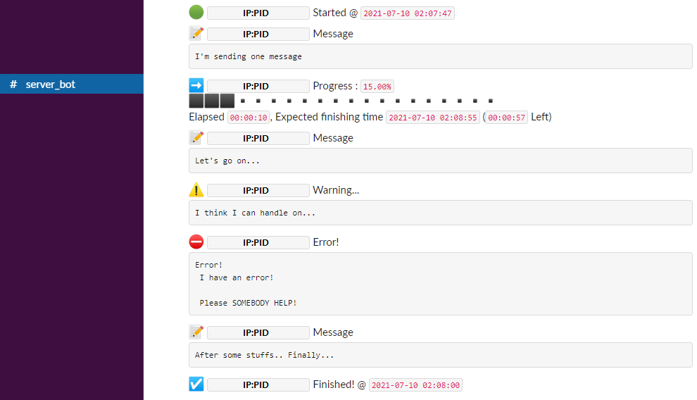

# Informer Slack Bot for Server Experiment

This is a simple slack bot usable with python environment which allows you to send your remote server's experiment status to slack environment easily.

# Installation
1. Create Slack app from [api.slack.com](api.slack.com) and get api token. More Specifically, please refer [python-slack-sdk](https://github.com/slackapi/python-slack-sdk/blob/main/tutorial/01-creating-the-slack-app.md)'s install page.
2. `pip install slack_sdk`
3. copy `slackBot.py` to your working directory 
4. `from slackBot import slackBot`, and you're good to go.

You can edit the location of the `slackBot.py`'s location, but you need to edit the import location.

## Post-Installation

On your code, you should call `slackBot.SetToken('your-token')` to set token to work correctly.

If there's no channel name with `#server-bot`, you should call `slackBot.SetChannel('#channel-name')` to set channel. Otherwise, will not work.

If you are running things on docker, ip address and pid will not shown normally. usd `slackBot.SetProcessInfo('name')` to set manually.
# API
Please see the `demo.py`. Result of the `demo.py` is shown below.


### `slackBot.SetToken(token)`
**Mandatory**. Sets the token for slackBot.
### `slackBot.SetProcessInfo(name)`
Set Process Information manually. Useful on docker environment.
### `slackBot.SetChannel(channel)`
Sets a channel to send message. If called again, it will change default channel. Sends a message to the channel.
### `slackBot.ResetStartTime()`
Resets `startTime` which used to calculate estimated time. Use this to measure more time specifically like just before start of the training.

### `slackBot.SendProgress(progress, [estimated, length, message, channel])`
Sends progress message to the channel.
 - `progress(float)` should be a float value between 0 and 1
 - If `estimated(bool)` is set to false, it will not print estimated time.
 - If `length(int)` is set, it will change length of the progress bar. set to `0` to disable it.
 - additional message can be set using `message(string)`
 - provide `channel(string)` to send to specific channel. Otherwise, it will send to default channel or channel set by `SetChannel`.

example:
```python
slackBot.SendProgress(0.4) # 40% Completed
```

### `slackBot.SendStartSignal([message, channel])`
Sends start signal message to the channel.
 - additional message can be set using `message(string)`
 - provide `channel(string)` to send to specific channel. Otherwise, it will send to default channel or channel set by `SetChannel`.

### `slackBot.SendEndSignal([message, channel])`
Sends end signal message to the channel.
 - additional message can be set using `message(string)`
 - provide `channel(string)` to send to specific channel. Otherwise, it will send to default channel or channel set by `SetChannel`.

### `slackBot.SendError(message, [channel])`
Sends error-style message to the channel.
 - `message(string)` should be provided. It shouldn't be empty.
 - provide `channel(string)` to send to specific channel. Otherwise, it will send to default channel or channel set by `SetChannel`.

### `slackBot.SendWarning(message, [channel])`
Sends warning-style message to the channel.
 - `message(string)` should be provided. It shouldn't be empty.
 - provide `channel(string)` to send to specific channel. Otherwise, it will send to default channel or channel set by `SetChannel`.

### `slackBot.SendMessage(message, [channel])`
Sends message to the channel.
 - `message(string)` should be provided. It shouldn't be empty.
 - provide `channel(string)` to send to specific channel. Otherwise, it will send to default channel or channel set by `SetChannel`.

### `slackBot.SendPing()`
Sends a ping to currently set channel. Which can notice channel is set correctly.

### `slackBot.DisableLimit()`
Disables limit that preventing slackBot sends way many messages in specific amount of seconds.

### `slackBot.EnableLimit()`
Enables limit that preventing slackBot sends way many messages in specific amount of seconds.
